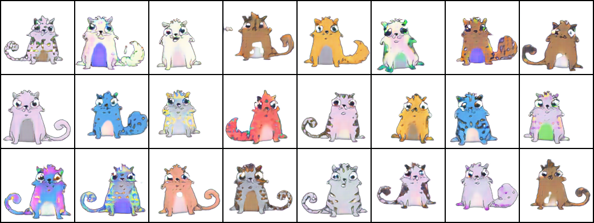
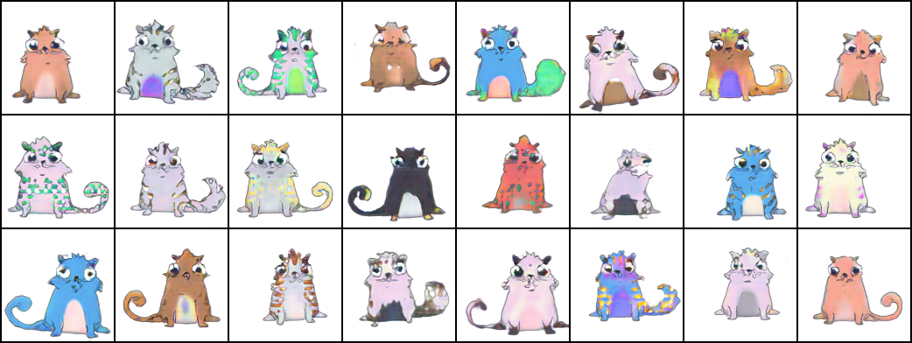
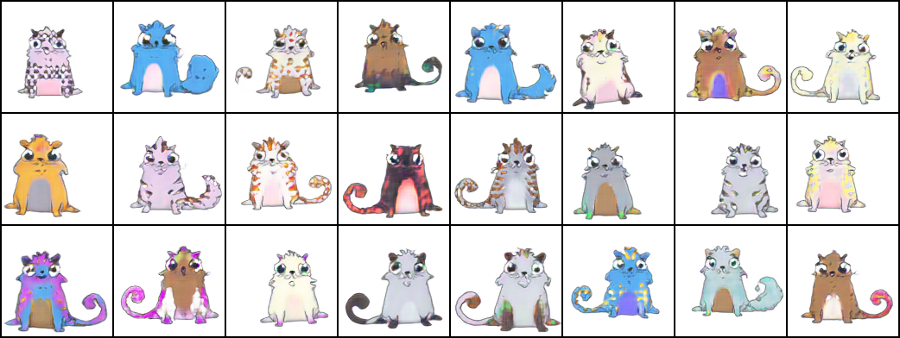

# GAN stability - Cryptokitty edition
This repository contains an experiment based on the paper [Which Training Methods for GANs do actually Converge?](https://avg.is.tuebingen.mpg.de/publications/meschedericml2018), using a dataset of cryptokitties.

You can find further details on [the project page](https://avg.is.tuebingen.mpg.de/research_projects/convergence-and-stability-of-gan-training).

# Usage
First download your data and put it into the `./data` folder.

To train a new model, first create a config script similar to the ones provided in the `./configs` folder.  You can then train you model using
```
python train.py PATH_TO_CONFIG
```

To compute the inception score for your model and generate samples, use
```
python test.py PATH_TO_CONIFG
```

Finally, you can create nice latent space interpolations using
```
python interpolate.py PATH_TO_CONFIG
```
or
```
python interpolate_class.py PATH_TO_CONFIG
```

# Notes
* Dataset consists of 50k Cryptokitties in 256x256 resolution.

# Results
## Cryptokitties



